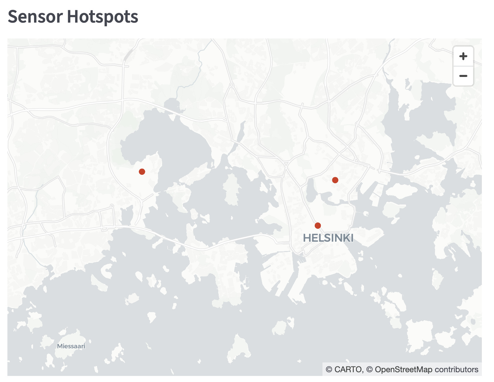
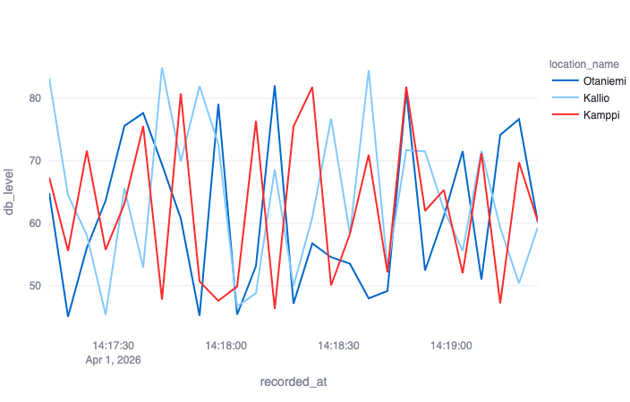

# Acoustic Noise Pollution Mapper
**A Full-Stack Data Pipeline for Geospatial Sound Analysis**

##  Overview
This project is a technical prototype designed to ingest, store, and visualize environmental noise measurements. It demonstrates an end-to-end data engineering workflow: connecting a Python-based data producer to a structured PostgreSQL database and providing a real-time reporting layer for technical insights.

##  Key Features
* **Automated Data Ingestion:** A Python pipeline that simulates real-time acoustic measurements (dB) and streams them into a relational database.
* **Structured Storage:** Designed a PostgreSQL schema to manage sensor metadata (Latitude/Longitude) and time-series noise logs with full relational integrity.
* **Visualization Dashboard:** A Streamlit-based web interface for exploring results, featuring live trend graphs and geospatial mapping.

### Visualization & Reporting Layer
| Geospatial Mapping (Helsinki Hotspots) | Noise Level Trends (Time-Series) |
| :---: | :---: |
|  |  |

This dashboard allows for the exploration of results from our "data ingestion pipeline" without requiring direct database access. It highlights noise fluctuations across our three primary sensor locations: Kamppi, Otaniemi, and Kallio.

## Technical Stack
* **Language:** Python (Pandas, Plotly, Psycopg2)
* **Database:** PostgreSQL (Schema Design & Relational Modeling)
* **Deployment/Visualization:** Streamlit
* **Version Control:** Git

## Project Structure
* `ingest_noise.py`: The "Digital Bridge" simulating raw measurement collection and database ingestion.
* `schema.sql`: The pre-structured database definition.
* `dashboard.py`: The reporting layer for data exploration without touching code.

## How to Run
1. **Initialize Database:**
   `psql -d noise_db -f schema.sql`
2. **Start Ingestion:**
   `python ingest_noise.py`
3. **Launch Dashboard:**
   `streamlit run dashboard.py`
